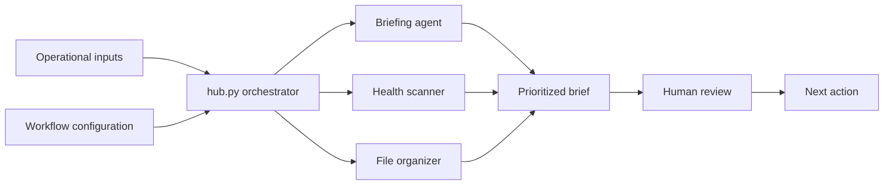

# Marketing Intelligence Agent

A lightweight local system for automating marketing intelligence workflows: performance monitoring, risk detection, workflow orchestration, and executive-ready briefing generation.

This project is designed to reduce manual reporting overhead and improve decision speed across complex marketing and paid media environments.

## Why this exists

Performance marketing creates fragmented signals across platforms, files, reports, inboxes, and team workflows. Most teams have dashboards, but dashboards do not always explain what matters, what changed, or what needs attention.

This agent addresses the synthesis layer.

It turns raw operational inputs into structured, prioritized intelligence so an operator can move faster without losing judgment.

## Architecture

```text
hub.py (orchestrator)
├── briefing_agent      — morning intelligence synthesis
├── health_scanner      — project and campaign health checks
├── file_organizer      — report and asset organization
└── config/modes.json   — composable workflow definitions
```



The orchestrator dispatches modular agents through a consistent interface. Workflows are defined through configuration rather than hardcoded sequences.

## Core concepts

- **Modular agents** — each agent exposes a consistent run interface
- **Config-driven workflows** — repeatable modes define how agents work together
- **State-aware execution** — avoids redundant work and supports repeatable routines
- **Signal scoring** — prioritizes high-value inputs and suppresses noise
- **Local-first operation** — designed to run without unnecessary cloud dependencies

## Capabilities

- **Intelligence briefing** — synthesizes inputs into a decision-ready report with scored prioritization
- **Health scanning** — evaluates project hygiene and system drift
- **Smart organization** — categorizes and routes files with dry-run preview
- **Composable workflows** — chains agents through configurable modes
- **Trend memory** — tracks signals over time for pattern detection

## Stack

- Python 3.12+
- SQLite for local state
- macOS automation where useful
- Gmail API for read-only workflows where configured

No required cloud runtime. Designed for local execution.

## Usage

Entry point: `hub.py`

Core local commands:

| Command | Purpose |
|---|---|
| `python hub.py` | Open the interactive menu |
| `python hub.py briefing` | Generate a morning intelligence report |
| `python hub.py mode morning` | Run a coordinated morning workflow |
| `python hub.py scan` | Run a project health check |
| `python hub.py mode deep_work` | Prepare a focused workspace workflow |
| `python hub.py audit` | Run a system health audit |

## Example output

See [`examples/example-run.md`](examples/example-run.md) for a mock briefing run that shows the intended output shape: detected signals, prioritized risks, and recommended next actions.

## Configuration

Copy the example configuration files before running local workflows:

| Example file | Local file |
|---|---|
| `config/projects.example.json` | `config/projects.json` |
| `config/modes.example.json` | `config/modes.json` |

Keep local configuration and private project data out of public commits.

## Related repos

This repo is part of a connected public system. See the [GitHub Ecosystem Map](https://github.com/silvermanjared-web/growth-architecture-os/blob/main/docs/ecosystem-map.md) for how the repos relate.

- [`growth-architecture-os`](https://github.com/silvermanjared-web/growth-architecture-os)
- [`marketing-ops-toolkit`](https://github.com/silvermanjared-web/marketing-ops-toolkit)
- [`marketing-ops-playbooks`](https://github.com/silvermanjared-web/marketing-ops-playbooks)

## Design principles

- **Diagnostic first** — measure before acting
- **Signal over noise** — prioritize what matters
- **Config over code** — workflows should be defined, not hardcoded
- **State-aware** — avoid redundant execution
- **Anti-drift** — build system auditing into the workflow
- **Human judgment stays in the loop** — automation should support decisions, not pretend to replace them

## What this demonstrates

This project reflects how I approach marketing operations and growth systems: structured workflows, repeatable routines, clear signal detection, and practical automation that reduces manual overhead without sacrificing judgment.