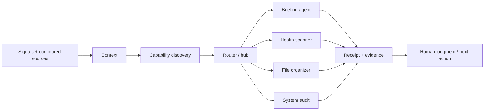

# Marketing Intelligence Agent 2.0

**An AI operating layer for growth intelligence.**

This repository turns fragmented marketing signals into prioritized decisions, routes repeatable work through declared capabilities, keeps consequential actions inside explicit authority boundaries, and returns evidence of what happened.

It is intentionally local-first and public-safe. The goal is not autonomous theater. The goal is reliable operating leverage.

## Five-minute proof

Run:

```bash
npm test
python3 -m src.core.capabilities discover
```

The first command runs smoke, unit, and security tests. The second prints the real capability surface.

Then inspect:

- `src/core/capabilities.py` for capability discovery and invocation.
- `src/core/receipts.py` for execution evidence.
- `hub.py` for orchestration.
- `src/agents/` for the actual agent implementations.
- `docs/ai-operating-system-reference.md` for the architecture mapping.

## Selected evidence

| Question | Evidence |
|---|---|
| Can it expose what it can actually do? | Explicit capability registry with effect and confirmation metadata |
| Can it separate observation from mutation? | Read capabilities and write capabilities are declared separately |
| Can it keep writes bounded? | `files.organize.apply` refuses execution without confirmation |
| Can it orchestrate multiple operating functions? | Briefing, health scanning, file organization, audit, and config-driven modes |
| Can clients interoperate without permission drift? | Transport-neutral capability contract plus MCP interoperability reference |
| Is the public repo testable? | Smoke, unit, security, and repository validation paths |

## What I built

The system combines growth-intelligence workflows with an explicit AI operating contract:


```mermaid
flowchart LR
    S[Signals + configured sources] --> C[Context]
    C --> D[Capability discovery]
    D --> R[Router / hub]
    R --> B[Briefing agent]
    R --> H[Health scanner]
    R --> F[File organizer]
    R --> A[System audit]
    B --> E[Receipt + evidence]
    H --> E
    F --> E
    A --> E
    E --> J[Human judgment / next action]
```

The operating layer is built around six concerns:

- **Context**: configured projects, modes, files, and source inputs.
- **Capabilities**: named operations the system can actually perform.
- **Routing**: hub-level orchestration and modular agent dispatch.
- **Authority**: explicit read/write effects and confirmation requirements.
- **Execution**: repeatable workflows instead of one-off prompting.
- **Evidence**: structured receipts, logs, and health state.

## Core point of view

Dashboards describe. Operating systems decide what deserves attention and make the next action easier.

My standard for AI-enabled marketing operations is:

- signal over noise;
- source-aware context;
- explicit capabilities;
- config before hardcoding;
- preview before mutation;
- bounded execution instead of general-purpose authority;
- human judgment for consequential marketing decisions;
- receipts after execution;
- self-maintenance where the system can safely handle it.

## Signature frameworks

### Signal → Decision → Action

1. **Signal**: detect a meaningful change.
2. **Decision**: frame why it matters and what must be resolved.
3. **Action**: route the next bounded operation or surface it to a human owner.

### Observe → Propose → Mutate

Read broadly enough to diagnose. Preview or propose when the effect is consequential. Mutate only through a named, admitted capability.

### Capability + receipt

A capability says what the system may do. A receipt says what it actually did.

That separation makes the system easier to inspect, test, and expose to multiple AI clients.

## Capabilities

Current public capability surface:

| Capability | Effect | Confirmation |
|---|---|---|
| `intelligence.brief` | read | no |
| `health.scan` | read | no |
| `files.organize.preview` | read | no |
| `files.organize.apply` | write | yes |
| `system.audit` | read | no |

Run `python3 -m src.core.capabilities discover` to inspect the registry directly.

## MCP and client interoperability

The capability layer is transport-neutral. ChatGPT, Claude, a CLI client, or an MCP-compatible surface can expose the same admitted capabilities without inventing a separate permission model.

MCP is treated as a client and transport boundary, not as the owner of business authority.

See [MCP interoperability](references/mcp-interoperability.md).

## Ecosystem map

This repository is the intelligence layer in the broader [Growth Architecture OS](https://github.com/silvermanjared-web/growth-architecture-os) portfolio.

- **Growth Architecture OS**: operating philosophy and growth leadership.
- **Marketing Intelligence Agent**: synthesis, monitoring, routing, and intelligence.
- **Marketing Ops Toolkit**: deterministic checks and bounded operational execution.
- **AI Context & Design System**: structured context and AI-assisted design handoff.
- **Private-to-Public Release Gate**: privacy-safe publication boundary.

The shared AI operating-system reference lives in [Growth Architecture OS](https://github.com/silvermanjared-web/growth-architecture-os/tree/main/04-ai-systems/ai-operating-system-reference).

## How to read this repo

For a five-minute evaluation, run the tests and inspect the capability registry.

For architecture, read `docs/ai-operating-system-reference.md`.

For executable behavior, read `hub.py`, `src/agents/`, and `src/core/`.

For safety and authority, read `GOVERNANCE.md`, `SECURITY.md`, `CHATGPT.md`, and `CLAUDE.md`.

For public evidence boundaries, read `proof-points.md`.

## Usage

Core commands:

```bash
python3 hub.py briefing
python3 hub.py scan
python3 hub.py organize
python3 hub.py clean --confirm
python3 hub.py mode morning
python3 hub.py audit
python3 -m src.core.capabilities discover
```

`organize` is preview-only. Live file organization requires the explicit `clean --confirm` path.

## Further reading

- [AI operating-system mapping](docs/ai-operating-system-reference.md)
- [MCP interoperability](references/mcp-interoperability.md)
- [Proof points](proof-points.md)
- [Security policy](SECURITY.md)
- [Governance](GOVERNANCE.md)

## Related repos

- [Growth Architecture OS](https://github.com/silvermanjared-web/growth-architecture-os)
- [Marketing Ops Toolkit](https://github.com/silvermanjared-web/marketing-ops-toolkit)
- [Private-to-Public Release Gate](https://github.com/silvermanjared-web/private-to-public-release-gate)
- [AI Context & Design System](https://github.com/silvermanjared-web/brand-context-system)

## IP and usage

This repository is public for professional review and portfolio context. It is not a distribution of private operating-system data or integrations and is not licensed for commercial reuse, resale, model training, or derivative productization without permission.

See [USAGE.md](USAGE.md).